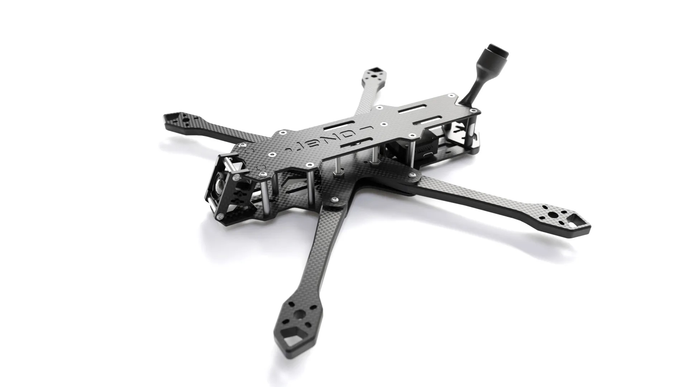
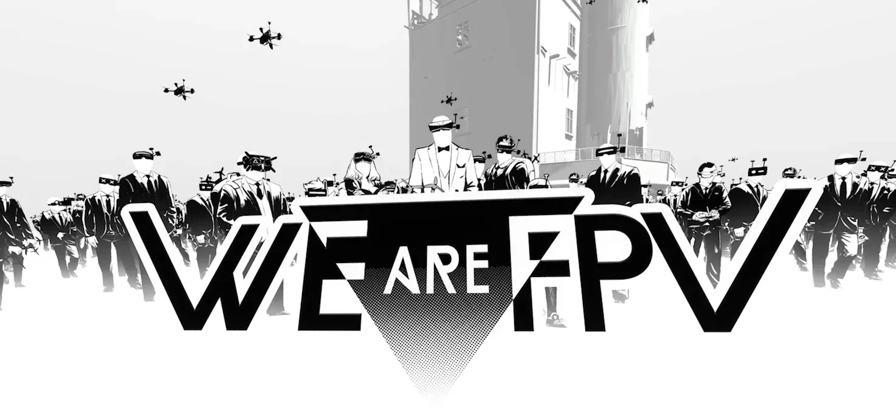
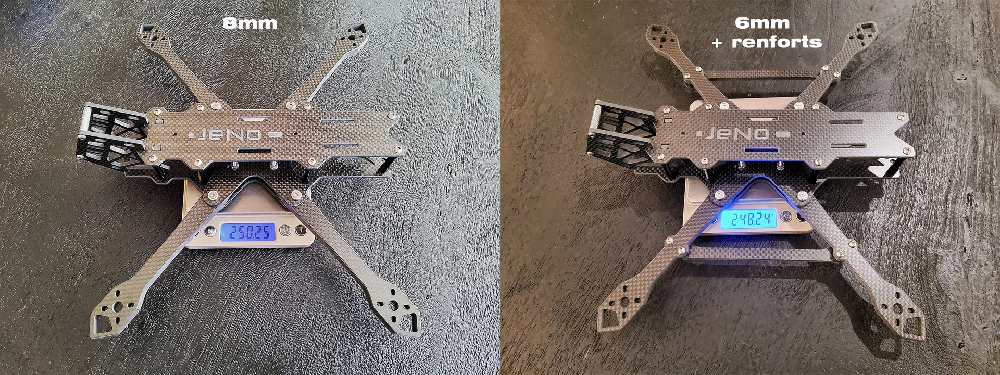
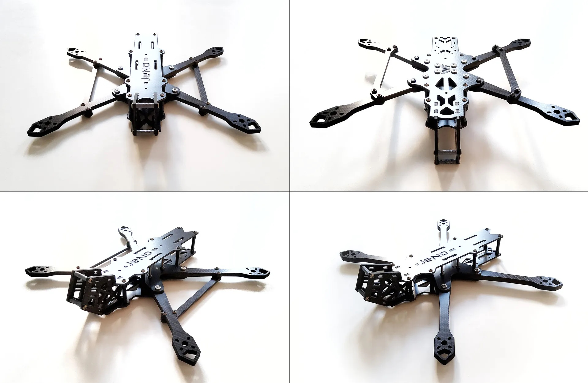
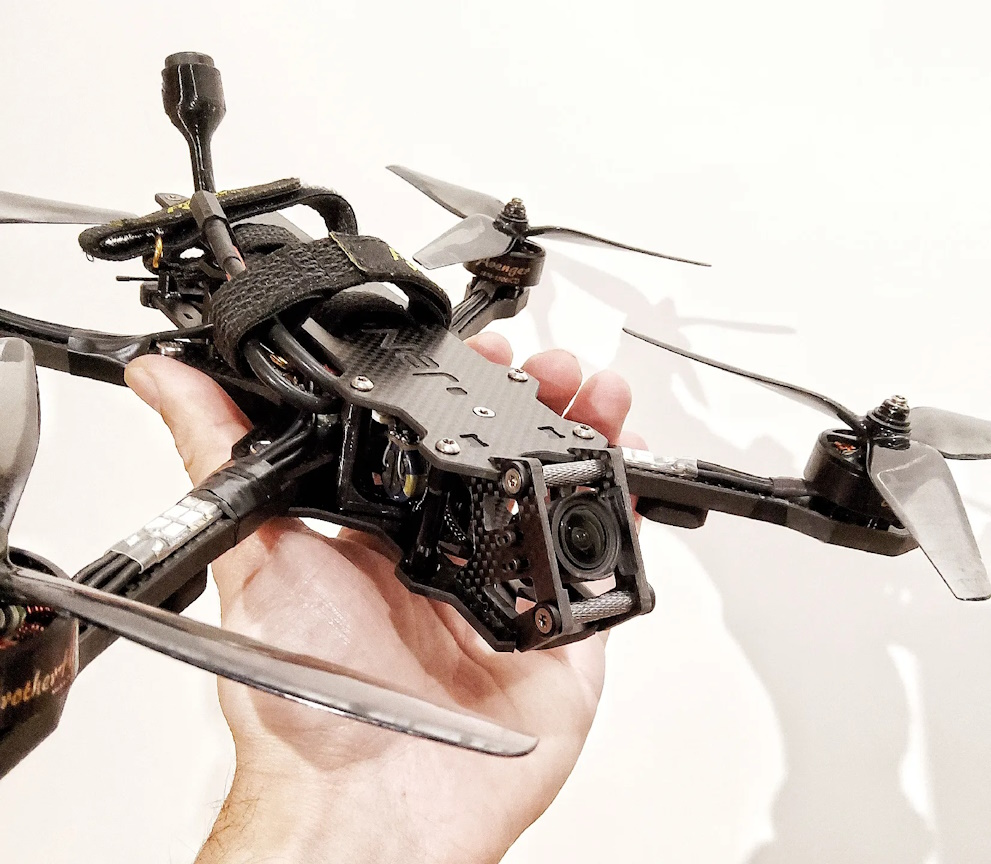
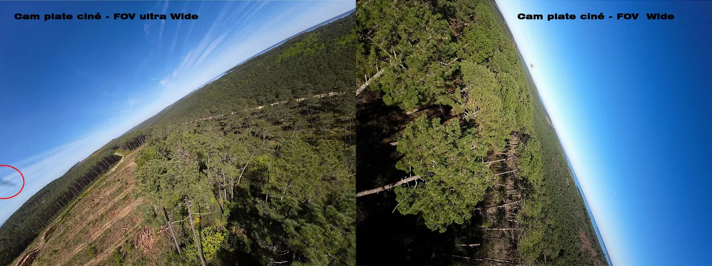
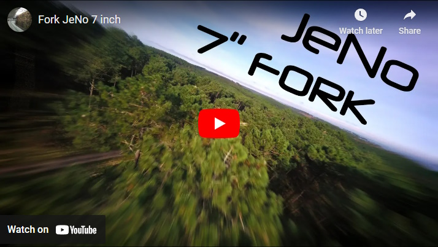

# JeNo 7"
_**7" drone FPV frame compatible with Air Unit O3 and designed for LR, Cinematic, Freeride and even Freestyle. Many customizable options available.**_

Designed in France by members of the [WE are FPV](https://www.wearefpv.fr/) community. The French version of the project is available on [Printables](https://www.printables.com/fr/model/339099-jeno-51-drone-frame). Note that a [3-3.5" version](https://github.com/WE-are-FPV/JeNo-3-3.5) and a [5.1-6" version](https://github.com/WE-are-FPV/JeNo-5.1) of the JeNo exist.

## Key features
- [x] **Sturdiness** and **rigidity** (6 or 8 mm arms)
- [x] Designed as a **real 7"**, not 5" conversion
- [x] Excellent flight **performances**, easy to tune
- [x] **Wide-X** geometry
- [x] Perfect DJI **Air Unit O3** camera integration
- [x] Designed for : DJI Vista/AU O3, WalkSnail, HDZero, Analogic
- [x] **Frame and standoffs NOT visible** in video feed, with any FPV camera
- [x] Stack **decoupled** from the arms
- [x] **Easy maintenance** : remove 2 screws to replace an arm
- [x] **Roomy** (30 mm high)
- [x] **Customizable** (weight, arms, camera plates)

## Presentation
Building on the success of the [5.1-6" version](https://github.com/WE-are-FPV/JeNo-5.1) and [3-3.5" version](https://github.com/WE-are-FPV/JeNo-3-3.5) versions, the **JeNo lineup** expands with this new variation in **7"**. We stay true to the JeNo spirit, offering a **versatile frame** that is perfect for **Long Range, cinematic**, and even **Freestyle** use, thanks to its strength and flight performance.

Given the limited options in the **Open Source** community for 7", especially for DJI O3 setups, we wanted to provide the community with a solid new option that caters to various needs while remaining true to the **"JeNo philosophy"** :

* **Clean Black Box** for easy tuning
* **Modularity**, with **8mm arms** (or 6mm with reinforcements) and a wide range of camera plates:
  - Classic at 25°
  - High tilt at 40°
  - Cinematic with clean FOV ("Wide") / 25° tilt (hard or soft)
  - Cinematic with clean FOV ("Wide") / 40° tilt
* Frame and spacers invisible in the video feed with all cameras
* **100% clear FOV** with DJI O3 setups with cinematic camera plates (no frame or propellers visible)
* **Wide X** geometry for better flight feel
* Comfortable bus for lipos up to over 6S / 3000mAh (+140mm available)

Finally, as this frame was designed by members of the [WE are FPV](https://www.wearefpv.fr/) **community**, a **"WaF edition"** is available (the logo is engraved on the bottom plate). Join us on the WAF forum in [the official JeNo 7" thread](https://forum.wearefpv.fr/topic/22687-jeno-7/) to discuss it further.

The JeNo is also available in [5.1-6" version](https://github.com/WE-are-FPV/JeNo-5.1) and [3-3.5" version](https://github.com/WE-are-FPV/JeNo-3-3.5).

## Detaileds specifications

||| 
| :--- | :--- |
| **Geometry** | **Wide-X** | 
| **Props size** | 7" | 
| **Weight** | **248 to 260 g** depending on the versions, including screws | 
| **Arms** | **6 mm** (with 4mm reinforcements), **8mm** | 
| **Body height** | 30 mm | 
| **Stack height** | 19.5 to 21.5 mm depending the arms heights | 
| **Bottom plate** | 3mm | 
| **Middle plate** | 2.5 mm | 
| **Top plate** | 2.5 mm | 
| **Camera plates** | 3 mm | 
| **Motors mounting** | 16 to 19 mm | 
| **Camera** | 20 mm (DJI), Micro, Nano. **Clear FOV**. Ajustable.
| **Main stack** | 25.5 mm x 25.5 mm (M2) AiO and 20 mm x 20 mm (M2) stack | 
| **Back stack** | 20 mm x 20 mm and 25 .5 x 25.5 mm | 
| **Supported VTX** | Analogic, DJI Vista, DJI Air Unit O3, WalkSnail, HDZero… | 
| **Strap passage** | Yes | 

## Customization
As usual, this JeNo is **customizable** : it offers several **options** to best adapt to different needs and preferences.

### The arms
We **strongly recommend** having the version with **8mm** arms cut (see Black Box a little further down). However, the version with 6mm + reinforcements remains entirely viable in case you have constraints on the availability of 8mm carbon.

The weight of the two versions remains very similar.

### Camera plates and O3 integration

`The use of a 200mm coaxial cable is mandatory.`

Remarks regarding the **PWM frequency** of ESCs:

* **DJI recommends** using a PWM frequency of **48 kHz** or higher for effective stabilization
* However, a PWM frequency of **24 kHz is generally recommended for 7"**
* We have not observed stabilization issues while remaining at 24 kHz, even with a "hard mount". Therefore, we encourage you to test 24 kHz before anything higher.

Comparison of **FOV** with specific 7" Cinematic camera plates:

The "cinematic" camera plates will allow you to enoy a completely clear FOV with a **wide FOV** (and consequently, after stabilization).

Several types of camera plates are available, so you will need to **choose** the type of camera plate that best suits **your needs**.

## Cut it !

You can get it cut in your favourite flavour and source the materials yourself. There is no packaged version planned at the moment.

## Bill of materials

In addition to the carbon fiber, you will need the following hardware to complete the assembly of the frame.

**Standoffs**

It is recommended to use 5mm diameter standoffs, especially for those that will serve as support for TPU (backpack and capacitor). Moletted spacers can still be used, but the TPU supports will need to be modified accordingly.

| Quantity | Description | Details |
| :---: | :--- | :--- |
| 10 | M3x30mm standoffs | for the body |
| 2 (or 4 for cinematic plates) | M3x20mm standoffs | for the camera |

**Stack materials**

* If 30x30 stack

| Quantity | Description | Details |
| :---: | :--- | :--- |
| 4 | M3x20mm countersunk screws | for the stack |
| 4 | M3 nuts for stack screws | |

* If 20x20 stack

| Quantity | Description | Details |
| :---: | :--- | :--- |
| 4 | M3x20mm countersunk screws | for the stack |
| 4 | M3 nuts for stack screws | |

**Frame materials**

| Quantity | Description | Details |
| :---: | :--- | :--- |
| 6 | M3x6/8mm countersunk screws | for the top plate |
| 4 | M3x6/8mm screws | for the top plate |
| 10 | M3x8mm screws (titanium if possible) | Bottom plate |
| 4 (or 8 for cinematic plates) | M3x6/8mm screws (titanium if possible) | Camera plates |
| 12 | Pressnuts ([Flywoo](https://www.drone-fpv-racer.com/flywoo-m3-clinch-nuts-20-pcs-7965.html?aff=64&id_campaign=13#/1063-couleur-titane) or SourceOne alike) | |
| 4 | M3x18mm countersunk screws + washers or M3x16mm screws (steel if possible)  | for the arms (2 mm shorter for 6mm arms) |
| 4 | M3x12mm countersunk screws + washers or M3x10mm screws (steel if possible) | for the arms (2 mm shorter for 6mm arms) |

**Additional materials 6mm amrs  renforcements**

| Quantity | Description | Details |
| :---: | :--- | :--- |
| 8 | Pressnuts ([Flywoo](https://www.drone-fpv-racer.com/flywoo-m3-clinch-nuts-20-pcs-7965.html?aff=64&id_campaign=13#/1063-couleur-titane) or SourceOne alike) | 2 per arm) |
| 8 | M3x12mm screws | 2 per arm |

**Additional materials**

| Quantity | Description | Details |
| :---: | :--- | :--- |
| 16 | M3x12mm screws (if using arms protections) or M3x8mm (if no TPU) | for the motors (2 mm shorter for 6mm arms) |
| 4 | M2x5mm screws | for the camera |

**Fasten the lipo**

The JeNo allows the use of non-slip straps thanks to its strap slots. You can also use a LiPo pad if desired.

## Building/Assembly guide
The assembly of the frame is straightforward; however, a few clarifications:

* On one of the two sides of the **middle plate**, there are countersunk holes to accommodate countersunk screws. This side corresponds to the **underside**. Do not forget to install the stack screws before installing the middle plate.
* The pressnuts will be positioned on the underside of the bottom plate.
* An RX T antenna can be fixed to the rear of the JeNo using zip ties.
* Six screws of the top plate are countersunk screws to avoid damaging the battery.

## Inspiration
The JeNo 7" takes inspiration from the path laid out by the [KayouLoin](https://kayou-frames.com/fr/frames/25-kayouloin-7-frame.html).

While implementing 8mm arms remains quite evident, the KayouLoin innovates by introducing a **body that matches the quad's proportions**.

Certainly, this adds weight, but it provides the frame with unparalleled comfort in accommodating suitable batteries and absolute rigidity in holding the arms. If the cutting and sourcing of hardware are too constraining for you, we advise you to go directly to [Kayou's website](https://kayou-frames.com/fr/) !

## Tuning, Betaflight Preset ?
We probably won't provide a preset because motor setups have a huge influence, but here are some recommendations from Mark Spartz for 7" setups:

* ESCs PWM Frequency at **24KHz**
* **Reduce I** compared to a 5" (start with the slider at 0.5)

## Blackbox

Here is an overview of vibration distribution on the 3 axes for the JeNo 7". On the right with 6 mm arms (+ reinforcements), on the left with 8 mm arms. This is indeed the **unfiltered** gyro signal for a 3 minutes freestyle flight :

## Videos
Freestyle with JeNo :

## Builds examples

## Authors

The JeNo was designed by :

* nochamo - [Youtube](https://www.youtube.com/user/nochamo)

## TPU
For now, a **minimalist TPU kit** is available to you, containing:

* O3 antenna mount
* 50V capacitor mount + spike absorber
* Rear bumper + RX antenna mount

This offering will expand over time thanks to the community.

## Community (remixes and TPU)

**Fork/remix**

**TPU**

In addition to the TPU options available on this page, you will find here some TPU designs created by the community.

## Changelog

`Compatibility is consistently maintained between each version: if your frame was a v1, the parts from v1.2 will be compatible. The same applies to TPU accessories. That's why we don't keep the history of previous versions.`

**23/04/2024 :** Version 1.0